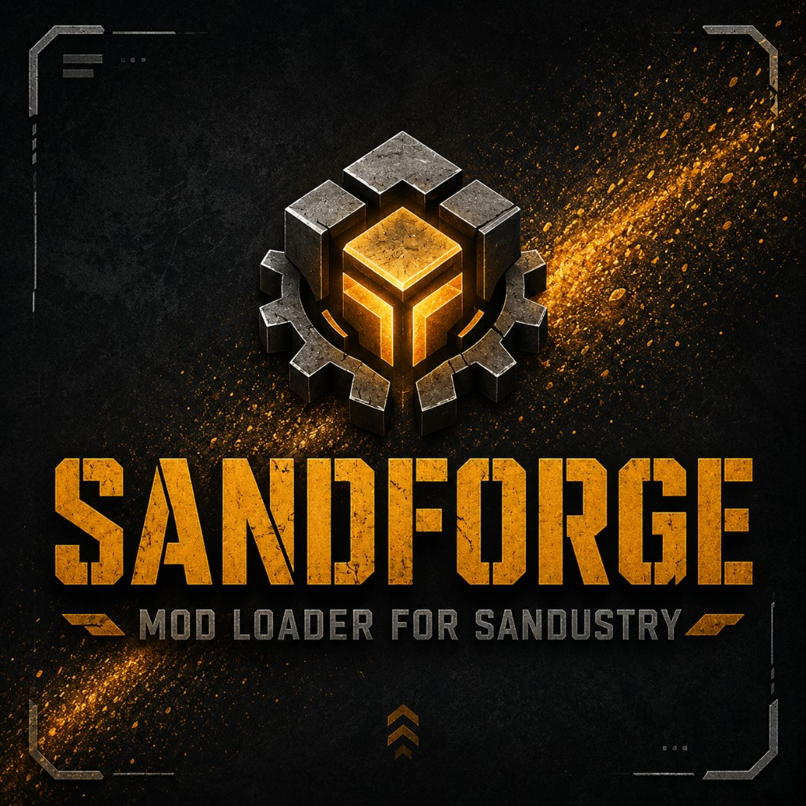

# SandForge Loader



SandForge is an unofficial mod loader for the Windows version of Sandustry. It
keeps the normal Steam launch flow while giving mods access to the Electron
main process, game renderer, simulation workers, and a shared runtime API.

**Version:** 1.0.0 · **Platform:** Windows

> SandForge is a community project. It is not affiliated with Sandustry,
> its developers, or Steam.

## Features

- Loads local mods and Steam Workshop items
- Supports separate Electron, renderer, and worker entrypoints
- Applies in-memory patches without modifying the original game archive
- Provides APIs for events, commands, config, storage, assets, networking,
  inter-mod communication, and more
- Remains compatible with standard Sandkit mods

## Installation

SandForge currently supports Windows only. Choose a permanent folder before
installing: Sandustry links to that folder and the loader will stop working if
it is moved or deleted.

1. [Download the repository](https://github.com/InfinityTheHoly/sandforge-loader/archive/refs/heads/main.zip)
   and extract it to a permanent folder.
2. Fully close Sandustry. Make sure no `Sandustry.exe` processes are running.
3. Run `install.cmd`. Windows may ask for Administrator permission.
4. Launch Sandustry normally through Steam.

The installer preserves the original game archive in
`resources\vanilla\app.asar`. It does not modify that archive.

### Updating

Back up `%AppData%\sandustry\loader-config.json` and any local mods you want to
keep. Replace the loader files with the new version, then run `install.cmd`
again.
Steam updates and file verification may restore the original `app.asar`; if
SandForge stops loading afterward, rerun the installer.

### Uninstalling

Fully close the game and run `uninstall.cmd`. The script removes the loader
link and restores the original game archive.

## Installing mods

SandForge discovers mods from both Steam Workshop and the local mods folder:

| Source | Location |
| --- | --- |
| Steam Workshop | `steamapps\workshop\content\2764460\<itemId>\` |
| Local mods | `%AppData%\sandustry\mods\<folder>\` |

Each mod is a folder containing a `modinfo.json` file. If a local mod and a
Workshop mod use the same `id` or `modID`, the local copy takes priority.

Press **F6** in-game to restart Sandustry after changing a mod. **F12** toggles
the game window's DevTools.

> Electron entrypoints run with full Node.js access. Only install mods from
> authors you trust.

## Creating mods

Standard Sandkit entrypoints, patches, maps, and assets continue to work.
SandForge adds optional entrypoints for code that needs deeper access:

- `electronEntrypoint` runs in the Electron main process
- `gameEntrypoint` runs in the game renderer
- `workerEntrypoint` runs in both game workers
- `workerEntrypoints` targets the manager, simulation worker, or both
- `anvil.json` and `sandforge-patches.json` define in-memory code patches

Start with the [modding guide](docs/MODDING.md), browse the
[API reference](docs/API.md), or copy
[`examples/sandforge-companion`](examples/sandforge-companion) into your local
mods folder. TypeScript declarations are available in
[`types/sandforge.d.ts`](types/sandforge.d.ts).

`api.mods.reload(id)` reloads an Electron/game entrypoint and tells workers to
refresh within a few seconds. Use F6 for changes to startup patches,
`anvil.json`, main-process files, or the loader itself.

Only individual mods belong on Steam Workshop. **Do not upload the loader
itself.**

## Configuration

Loader settings are stored in:

```text
%AppData%\sandustry\loader-config.json
```

Example:

```json
{
  "maxMapDimension": 15360,
  "disabled": []
}
```

`maxMapDimension` changes the map-size limit patched into the Workshop host.
`disabled` contains mod IDs that should not load.

Set `SANDFORGE_MODS_PATH` to use a different local mods folder. Create that
folder before launching the game; a path that does not exist is ignored.

## Logs

- Loader and Electron plugin `console.log` output appears in the game's
  Electron/Steam log
- `api.logFile.write` writes to
  `%AppData%\sandustry\meta\sandforge-loader.log`
- Boot diagnostics are written to
  `%AppData%\sandustry\meta\sandforge-boot.json`

## Troubleshooting

### SandForge stopped loading after a game update

Fully close Sandustry and run `install.cmd` again. Steam updates and file
verification can restore `resources\app.asar`, which takes priority over the
loader.

### The installer says Sandustry is still running

Close the game and check Task Manager for any remaining `Sandustry.exe`
processes, then rerun the installer.

### The installer cannot find the game

Launch Sandustry once through Steam, close it, and rerun `install.cmd`. The
installer checks your Steam library folders and the standard Windows install
locations.

### The installer reports an existing `resources\app` folder

The installer only replaces a junction previously created by SandForge. It
will not delete a normal folder at that path. Move or remove that folder only
if you know where it came from, then rerun `install.cmd`.

### The game reports a missing vanilla `app.asar`

Run `uninstall.cmd`, verify the game files in Steam, and then run
`install.cmd` again. The loader requires a preserved stock archive at
`resources\vanilla\app.asar`.

### A mod is not detected

Confirm that the mod is a direct child of the local mods folder and contains a
valid `modinfo.json`. Folders beginning with `.` and folders named
`node_modules`, `wrapper`, `runtime`, or `loader` are ignored.

## How it works

Steam still launches the original `Sandustry.exe`. The installer copies
`resources\app.asar` to `resources\vanilla\app.asar`, removes the original
from its old location, and creates a junction from `resources\app` to the
SandForge folder. The loader starts first, adds mod support, and then runs the
preserved game archive.

## Related projects

- **SandForge Companion** (`sandustry.sandforge-companion`) reports loader
  status in game and includes API documentation and an arcade.
- **SandForge Toolkit** (`sandustry.sandforge-tk`) adds dedicated Mods and Maps
  menus and an in-game map editor. It works without the loader.

## License

SandForge Loader is available under the [MIT License](LICENSE).
